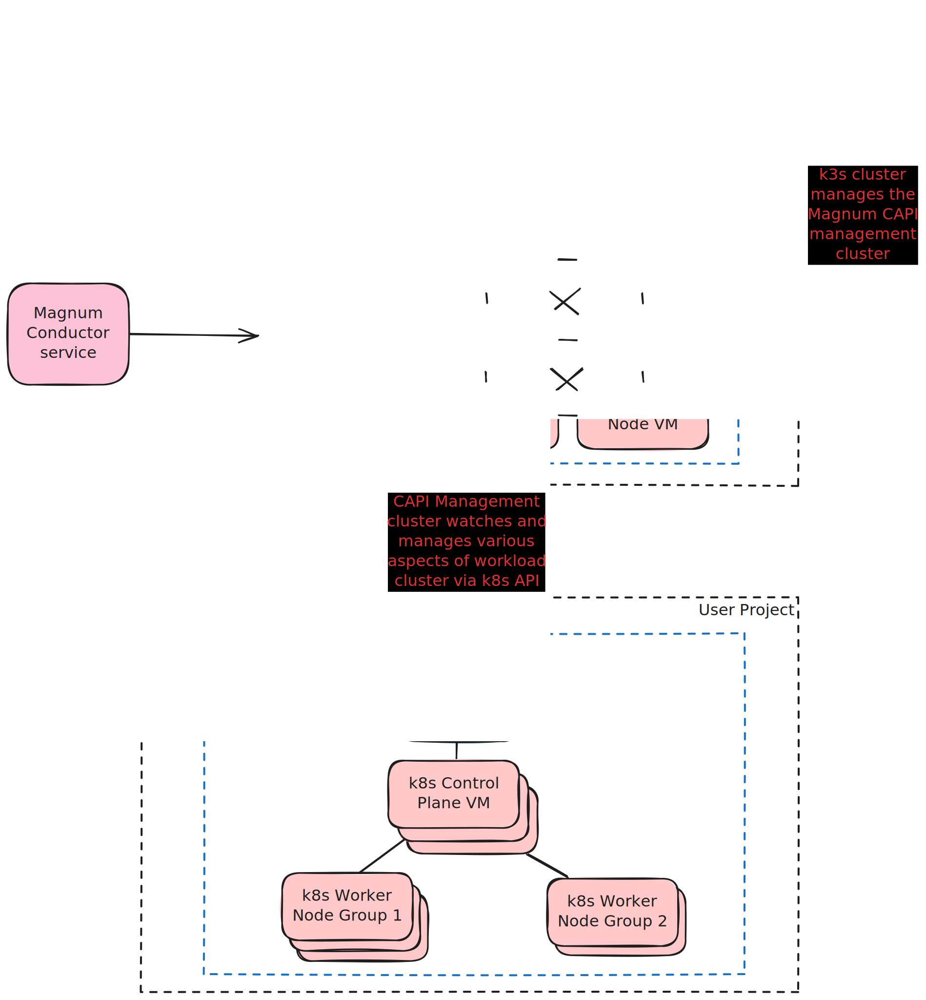
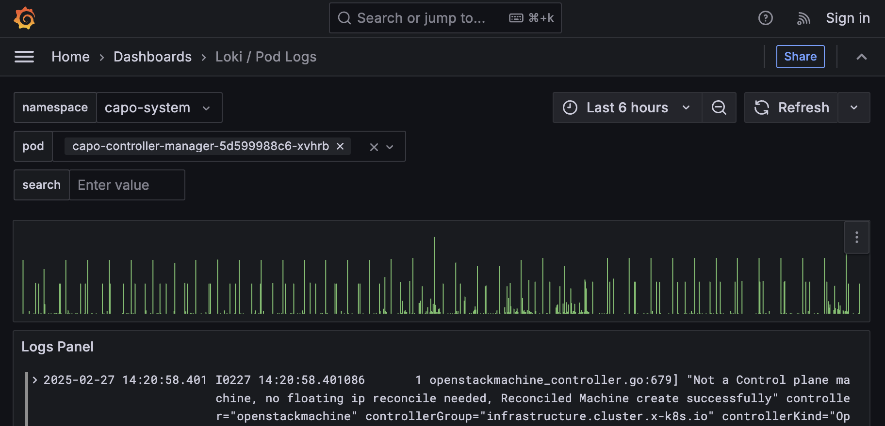

# Admin Guide

This guide is intended to serve administrators of the cloud-name Magnum service.

## Disclaimer

DISCLAIMER: This guide was initially written for a specific client and then retro-fitted as a generic template. To adapt this template to form the basis of a site-specific admin guide, replace all instance of `cloud-name` with the name of the actual cloud that the guide is intended for (then read through the whole document carefully to make sure nothing has been missed) and then remove this note.

## Background

The OpenStack Magnum service on cloud-name uses the [Cluster API (CAPI) Helm driver](https://opendev.org/openstack/magnum-capi-helm) for Magnum. For general background on this driver and it's goals, see <https://stackhpc.com/magnum-clusterapi.html>.

The core tenet of Cluster API is to use a separate Kubernetes 'management' cluster to manage the lifecycle of 1 or more Kubernetes 'workload' clusters (see [Cluster API Concepts](https://cluster-api.sigs.k8s.io/user/concepts)). The details of how this is achieve are non-essential but for more background see [this blog post](https://www.stackhpc.com/magnum-cluster-api-helm-deep-dive.html).

The Magnum Cluster API Helm driver itself is decoupled from the Cluster API management cluster and Magnum simply expects to be provided a [kubeconfig](https://kubernetes.io/docs/concepts/configuration/organize-cluster-access-kubeconfig/) file for the target management cluster as part of the Magnum driver set up to allow it to talk to an existing management cluster.
It will then use this management cluster to provision Magnum user clusters (otherwise known as 'workload' clusters in CAPI terminology).

Since the management cluster provisioning is outside of Magnum's scope, the cloud-name deployment re-uses StackHPC's [Azimuth](https://azimuth-config.readthedocs.io/en/stable/) tooling for provisioning and maintaining a production-ready management cluster.
The Magnum CAPI management cluster is effectively a stripped-down version of an Azimuth deployment with only the bare-minimum feature set required to manage CAPI workload clusters.
As such, some (but not all) sections of the [Azimuth operator documentation](https://azimuth-config.readthedocs.io) are relevant to Magnum. The goal of this admin guide is to distill the relevant information from the Azimuth documentation into something more applicable to the cloud-name Magnum service.

## Management Infrastructure

### Infrastructure As Code

The CAPI management cluster is provisioned using the [azimuth-ops](https://github.com/azimuth-cloud/ansible-collection-azimuth-ops?tab=readme-ov-file) Ansible collection, with this repository serving as the cloud-name-specific (i.e 'downstream') version of the generic upstream [azimuth-config](https://github.com/azimuth-cloud/azimuth-config) repository.
This downstream repository still 'tracks' the upstream azimuth-config in the sense that updating the cloud-name CAPI management cluster involves syncing this downstream repository with the latest upstream config. (In practice, this should be done via a GitHub / GitLab [scheduled pipeline](https://azimuth-config.readthedocs.io/en/stable/deployment/automation/#automated-upgrades).)

This repository defines a set of cloud-name-specific [config environments](https://azimuth-config.readthedocs.io/en/stable/environments/) which hold configuration overrides required for the cloud-name cloud (e.g. OpenStack network IDs, flavor names, etc).
This config is organised into a `cloud-name-base` 'mixin' environment and one ore more 'concrete' environments, for the each CAPI management cluster deployed on the cloud-name system.

In addition, the cloud-name config follows the recommended best practices for [managing secrets](https://azimuth-config.readthedocs.io/en/stable/repository/secrets/) and [storing infrastructure state](https://azimuth-config.readthedocs.io/en/stable/repository/opentofu/); therefore, both of these upstream documentation sections can be read as-is in relation to the cloud-name management cluster deployment.

For a new admin to access the cloud-name CAPI management infrastructure, they must first be granted access to the config repository secrets. This is done by asking an existing admin who already has access to add the new admin's GPG key by following [these instructions](https://azimuth-config.readthedocs.io/en/stable/repository/secrets/#using-gpg-keys).

Once access has been granted (by merging the commit with the new GPG key to the main branch) the new admin can now check out a local copy of the config repository and use it to access the CAPI management cluster and other supporting infrastructure. Before explaining how do to so, the next section provides a brief overview of the relevant OpenStack resources and how they interact with each other.

### A cloud-name Admin's Architecture View

From the perspective of an administrator, the architecture of the cloud-name Magnum service looks something like:



The remainder of this document explains how to access and troubleshoot each of these components.

### Accessing the Seed VM

The seed VM is the admin's gateway into the CAPI management infrastructure. The seed VM's SSH key and IP address are stored in the GitLab-backed terraform state within the config repository. Therefore, by being granted access to the config repositories secrets, an admin can use the provided helper scripts to fetch this securely stored terraform state and use it to SSH into the seed.
A more detailed explanation of this process can be found [here](https://azimuth-config.readthedocs.io/en/stable/debugging/access-k3s/) but the TL;DR is to run the following shell commands from the repository root:

```sh
# Ensure that the Python venv is set up
./bin/ensure-venv

# Activate the target environment
source ./bin/activate cloud-name-prod

# Install Ansible dependencies
ansible-galaxy install -f -r requirements.yml

# Execute the seed-ssh script
./bin/seed-ssh
```

If successful, you should be able to access the seed node via SSH.

### Accessing the Management Cluster

As illustrated in the architecture diagram above, the seed VM has the `kubectl` binary pre-installed, which can be used to interact with both the lightweight k3s cluster and the Magnum management cluster.
During the initial deployment, the `kubeconfig` file for the management cluster is written to `~/kubeconfig-capi-mgmt-<config-env-name>.yaml` on the seed
This allows us to use the `--kubeconfig` argument (or the equivalent `KUBECONFIG` environment variable) to authenticate and interact with the Magnum management cluster.

In the Magnum CAPI Helm driver, every Magnum user cluster ends up as a [Helm Release](https://helm.sh/docs/intro/using_helm/#three-big-concepts) (i.e. an installed instance) of the [magnum-capi-helm/openstack-cluster](https://github.com/azimuth-cloud/capi-helm-charts/tree/main/charts/openstack-cluster) chart. Therefore, to obtain a list of all Magnum clusters from the management cluster, we can use:

```sh
helm list --kubeconfig ~/kubeconfig-capi-mgmt-cloud-name-prod.yaml -Aa
```

Note: The `-A` means include all namespaces and so this will also show other Helm releases which are installed on the CAPI management cluster to provide. Each Magnum user cluster corresponds to a Helm releases under one of the `magnum-<openstack-project-id>` namespaces.
For more details on the various Kubernetes resources which are packaged as part of each Helm release, see <https://www.stackhpc.com/magnum-cluster-api-helm-deep-dive.html>.

If a Magnum user cluster exists in OpenStack but does not have a corresponding Helm release on the management cluster then this likely means that the Magnum conductor has been unable to communicate with the management cluster for some reason.
In such cases, the problem likely lies outside of Cluster APIs purview and the starting point for debugging should instead be the Magnum logs on the OpenStack control plane.

## Troubleshooting

### Admin Logs, Monitoring and Alerting

The management cluster has both [kube-prometheus-stack](https://github.com/prometheus-operator/kube-prometheus) (for monitoring various components of the management cluster) and [Loki](https://github.com/grafana/loki) for pod log aggregation.
Currently, the monitoring tools on the management cluster are only accessible using an SSH port-forward. A helper script is provide at `./bin/port-forward` in the cloud-name config repository. Using this script, the web dashboards for the various monitoring services can be accessed by running one of

```sh
# Port forward Grafana to localhost
./bin/port-forward grafana <local-port>
# Port forward Alertmanager to localhost
./bin/port-forward alertmanager <local-port>
# Port forward Prometheus to localhost
./bin/port-forward prometheus <local-port>
```

and then opening `http://localhost:<local-port>` in your web browser.

The Grafana configuration is currently limited to a relatively standard set of Kubernetes monitoring dashboards, with no Cluster API or Magnum-specific dashboards, however; it can still be useful for seeing general management cluster health.
Perhaps the most useful dashboard in the current set is the `Loki / Pod Logs` dashboard which allows for viewing, searching and filtering the aggregated logs for all management cluster pods.
This can be particularly helpful for inspecting the `capo-controller-manager` pod logs in order to debugging user cluster issues (see next section).

The pod logs dashboard looks something like:



and is a valuable tool in debugging since most pod logs in Kubernetes are aggressively pruned and therefore the Loki aggregation is the only option for historic logs.

Some other notable dashboards from the current monitoring collection include:

- `Alertmanager / Overview` - for alert trends and timeseries
- `Node Exporter / Nodes` - for health of management cluster nodes
- `Velero Overview` - for management [backup and restore](https://azimuth-config.readthedocs.io/en/stable/configuration/15-disaster-recovery/) health and status

### Diagnosing User Cluster Issues

For cases where there is a Magnum user cluster which is not functioning correctly (e.g. it is stuck in the creating phase indefinitely) the best strategy is to trace through the CAPI cluster creation process one step at a time for the target cluster in order to understand which step the creation is stalled on. To do so, follow [this debugging guide](https://github.com/azimuth-cloud/capi-helm-charts/blob/main/charts/openstack-cluster/DEBUGGING.md).
(The TL;DR is that 9 times out of 10 the answer can be found in the logs for the `capo-controller-manager` pod since this is the controller which interacts with the OpenStack APIs to actually create user resources.)
